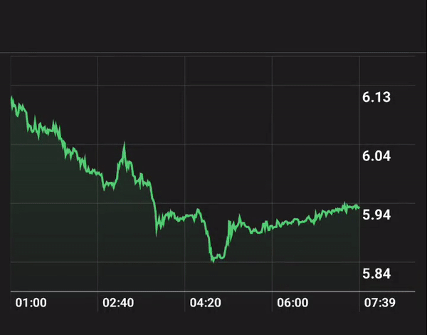

# react-native-cupertino-chart

React Native Cupertino Chart



## Installation

```sh
yarn add react-native-cupertino-chart
```

## Dependencies
- React Native Gesture Handler
- React Native Svg

## Usage

```js
import Chart from "react-native-cupertino-chart";

// ...

const App = () => {
    return (
        <Chart
          data={[{x: "01/02/2022", y: 5000}]}
          width={Dimensions.get("window").width}
          height={250}
        />
    )
}
```

## Contributing

See the [contributing guide](CONTRIBUTING.md) to learn how to contribute to the repository and the development workflow.

## License

MIT
